# 🏦 Bank Management System

## 📌 Description
This is a simple **Bank Management System** built using **Java** and **MySQL**. It allows users to:
- Create accounts
- Perform transactions (Deposit/Withdraw)
- Check account balance
- Manage customer records

## ⚡ Features
- Object-Oriented Java Implementation
- MySQL Database Integration
- User Authentication System

## 🛠 Prerequisites
- **Java (JDK 17 or above)**
- **MySQL installed and running**
- **MySQL Workbench (optional, for database management)**

## 🚀 Installation & Setup

### 1️⃣ Clone the Repository
```bash
git clone https://github.com/Siddhaganesh/Bank-Management-System.git
cd Bank-Management-System
```

### 2️⃣ Database Setup
Before running the program, set up the **MySQL database**.

1. Open **MySQL Workbench** (or any SQL client).
2. Create a new database by running:
   ```sql
   CREATE DATABASE bank_management;
   ```  
3. Select the newly created database:
   ```sql
   USE bank_management;
   ```  
4. Import the `bank.sql` file:
   - **Using MySQL Workbench**:
     - Click on **Server > Data Import**
     - Select **Import from Self-Contained File**
     - Choose `bank.sql`
     - Click **Start Import**
   - **Using Command Line**:
     ```bash
     mysql -u root -p bank_management < bank.sql
     ```
5. Ensure your **database credentials** in `BankManagementSystem.java` are correct.

### 3️⃣ JDBC Connection (Java & MySQL Integration)
The Java application connects to MySQL using **JDBC (Java Database Connectivity)**.
Below is a simple example of how the database connection is established:

```java
import java.sql.*;

public class DatabaseConnection {
    public static Connection connect() {
        Connection con = null;
        try {
            // Load MySQL JDBC Driver
            Class.forName("com.mysql.cj.jdbc.Driver");
            
            // Establish Connection
            con = DriverManager.getConnection("jdbc:mysql://localhost:3306/bank_management", "root", "password");
            System.out.println("Database Connected Successfully");
        } catch (Exception e) {
            e.printStackTrace();
        }
        return con;
    }
}
```

- `Class.forName("com.mysql.cj.jdbc.Driver")` → Loads the **JDBC driver** for MySQL.
- `DriverManager.getConnection("jdbc:mysql://localhost:3306/bank_management", "root", "password")` → Establishes a connection to the MySQL database.
- Replace **`root`** and **`password`** with your MySQL credentials.

### 4️⃣ Compile & Run
```bash
javac BankManagementSystem.java
java BankManagementSystem
```

## 📸 Screenshots  

### 🔐 Sign-In Page  
  

### 🆕 Sign-Up Process  
#### Step 1  
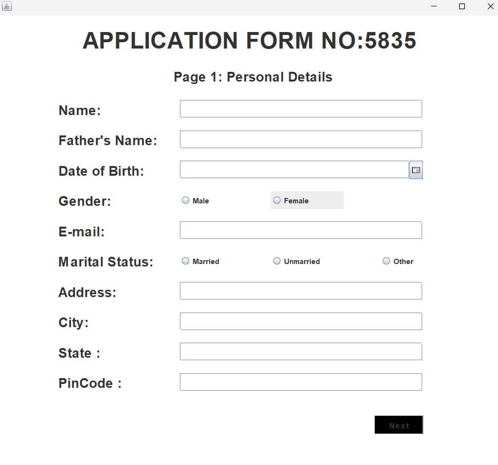  

#### Step 2  
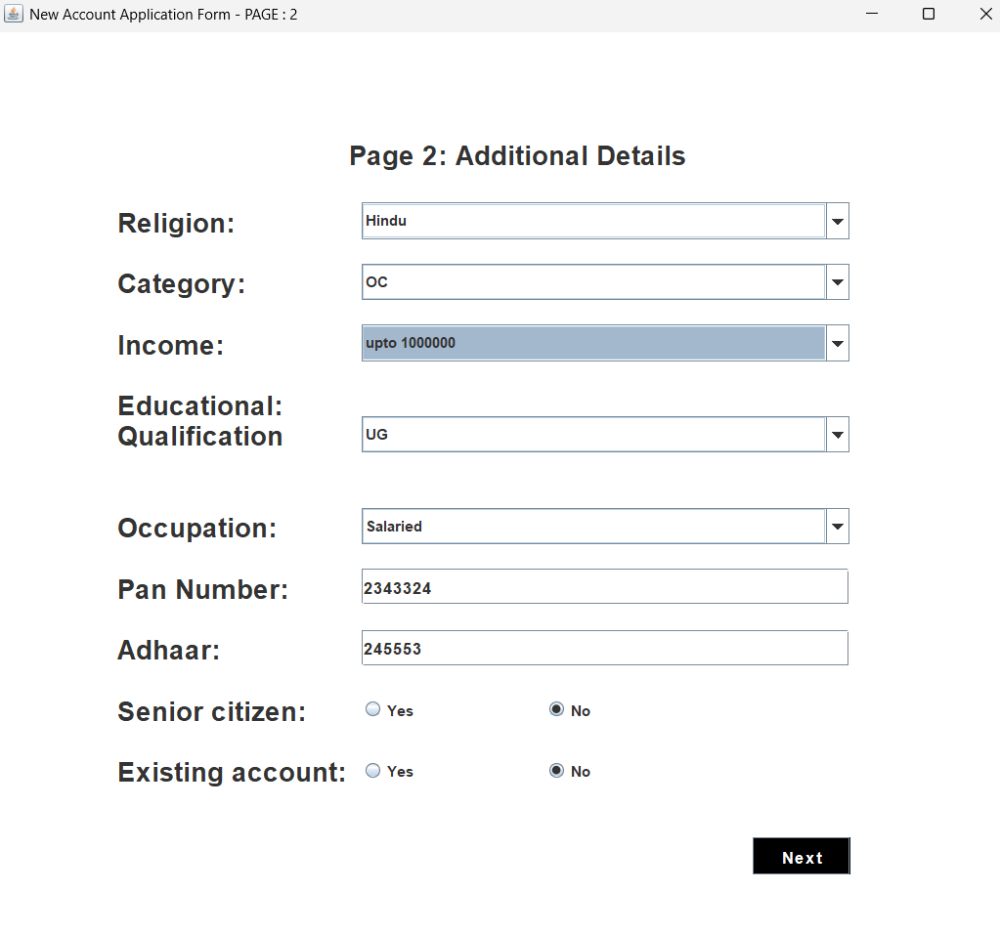  

#### Step 3  
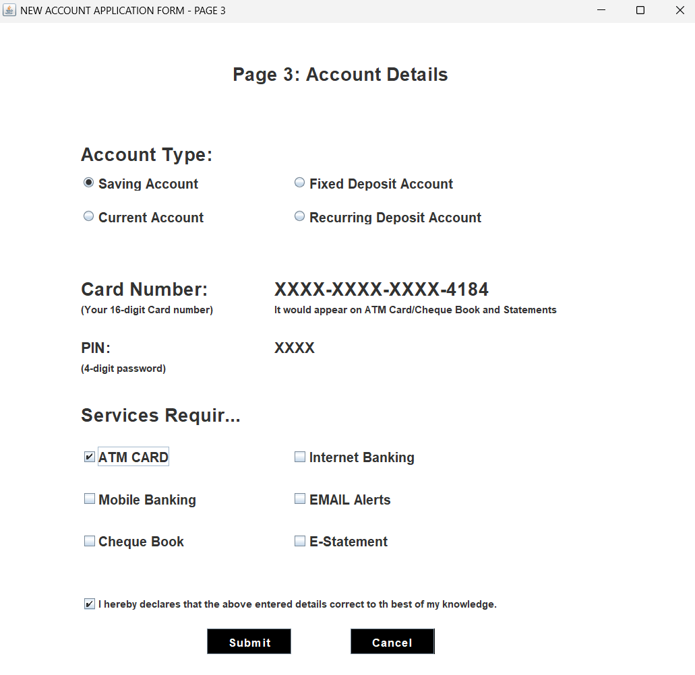  

### ✅ Acknowledgement Page  
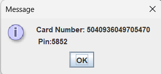  

### 🏷️ ATM Interface  
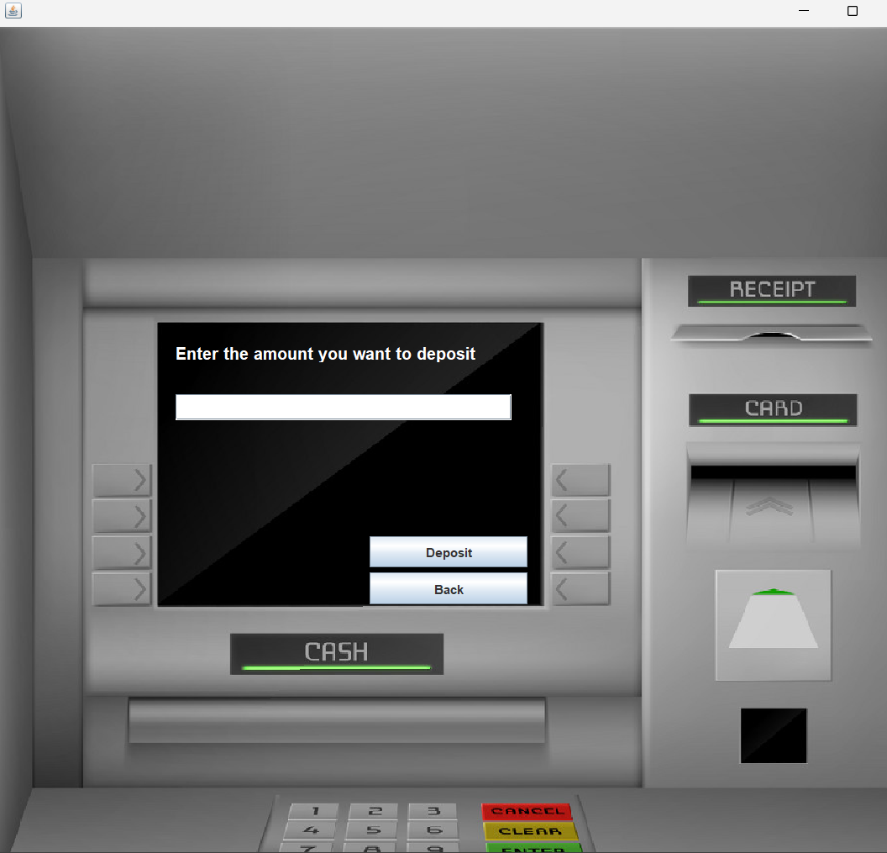  

### 💰 Deposit Money  
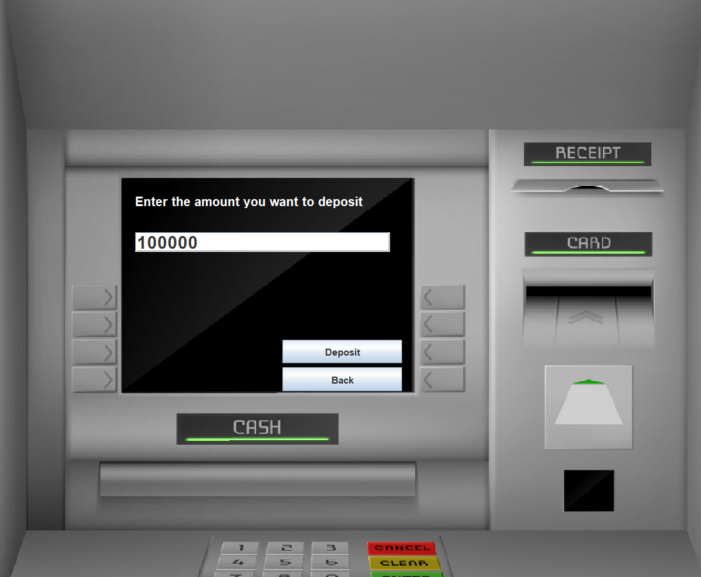  
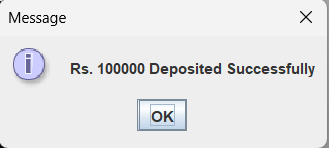  

### 📝 Transaction Page  
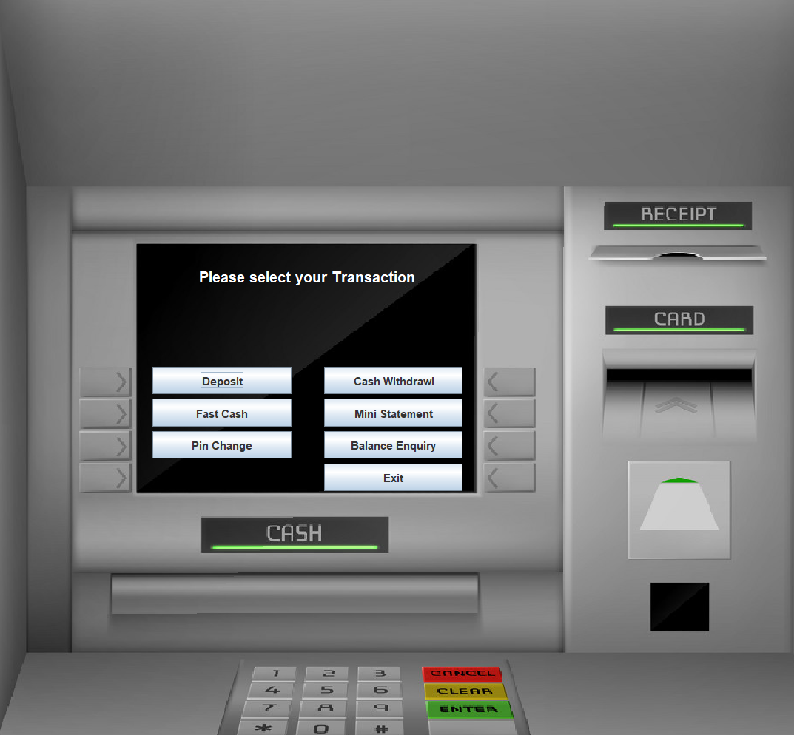  

### ➝ Withdraw Money  
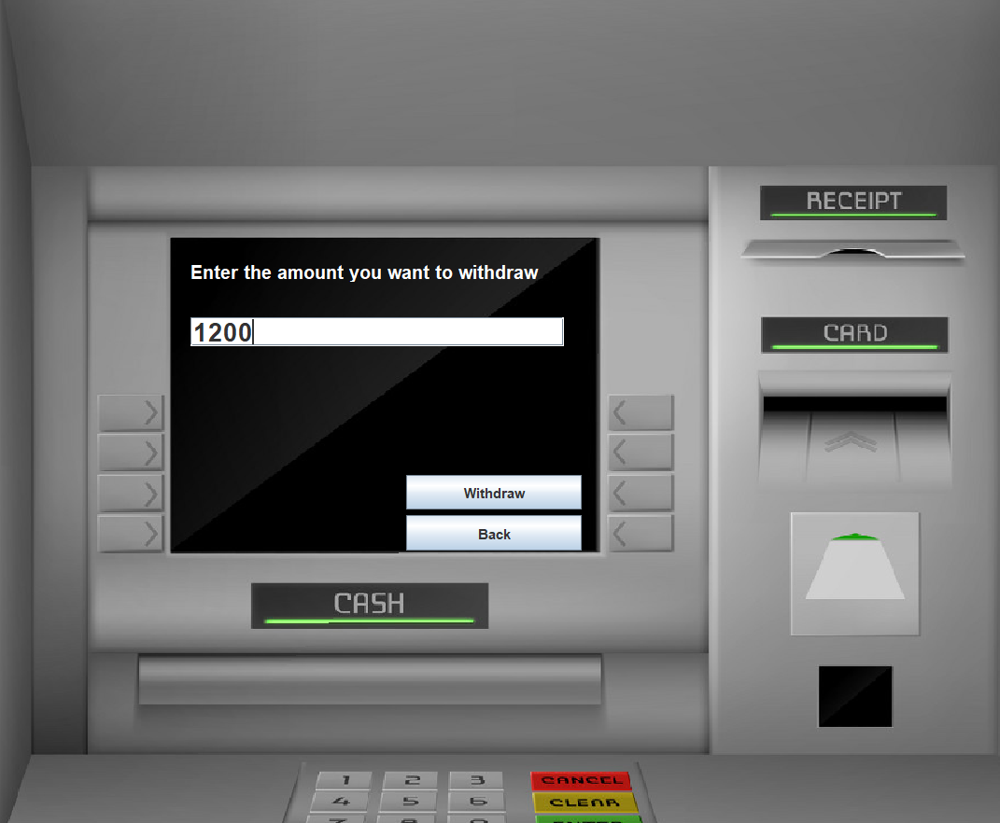  
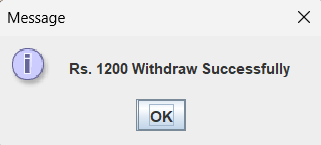  

### ⚡ Fast Cash Withdrawal  
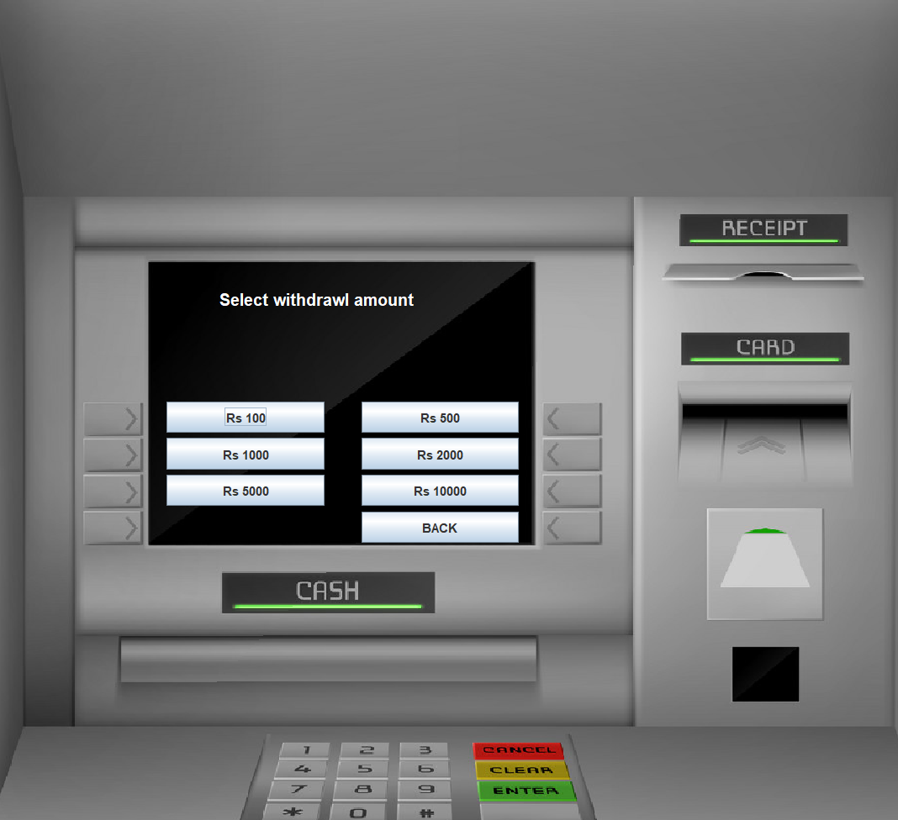  
  

### 📁 Mini Statement  
  

### 🔑 PIN Change  
  
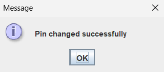  

### 💵 Balance Enquiry  
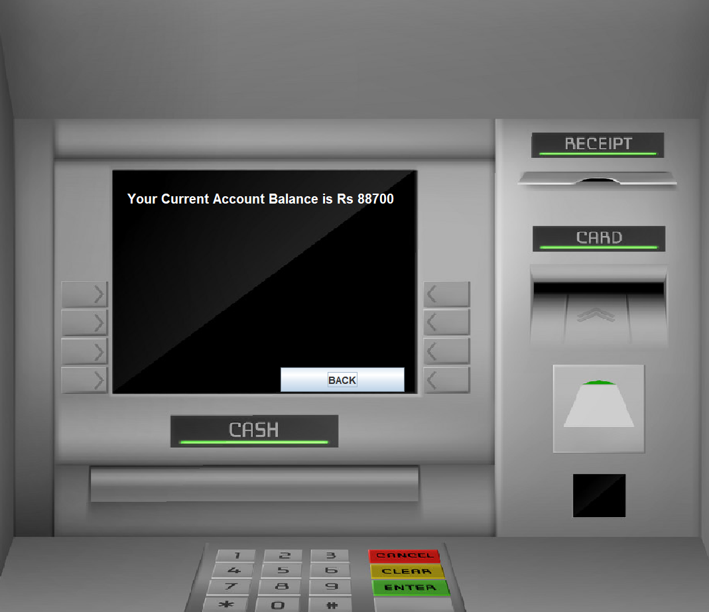  
