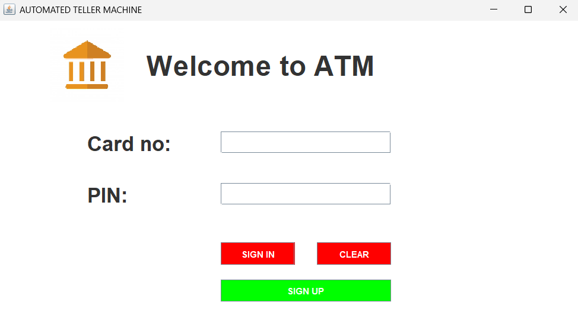

# 🏦 Bank Management System

## 📌 Description
This is a simple **Bank Management System** built using **Java** and **MySQL**. It allows users to:
- Create accounts
- Perform transactions (Deposit/Withdraw)
- Check account balance
- Manage customer records

## ⚡ Features
- Object-Oriented Java Implementation
- MySQL Database Integration
- User Authentication System

## 🔧 Prerequisites
- **Java (JDK 17 or above)**
- **MySQL installed and running**
- **MySQL Workbench (optional, for database management)**

## 🚀 Installation & Setup

1. **Clone the Repository**
   ```bash
   git clone https://github.com/Siddhaganesh/Bank-Management-System.git
   cd Bank-Management-System
2. **Compile & Run**
   ```bash
   javac BankManagementSystem.java
   java BankManagementSystem

## 🛠 Database Setup  

Before running the program, you need to set up the MySQL database.  

1️⃣ Open **MySQL Workbench** (or any SQL client).  
2️⃣ Create a new database by running:  
   ```sql
   CREATE DATABASE bank_management;
3️⃣ Select the newly created database:

sql
Copy
Edit
USE bank_management;
4️⃣ Import the bank.sql file into your database:

Using MySQL Workbench:
Open MySQL Workbench
Click on Server > Data Import
Select Import from Self-Contained File
Choose bank.sql from this repo
Click Start Import
Using Command Line:
bash
Copy
Edit
mysql -u root -p bank_management < bank.sql
5️⃣ Update your database credentials in the BankManagementSystem.java file (if needed).

Now your database is ready! 🎉

php
Copy
Edit

---

### **💡 How Java Connects to MySQL (JDBC Explanation)**  
Now, let’s explain **how Java is linked to MySQL using JDBC** so that you understand what's happening behind the scenes.  

#### **🔗 How Java Communicates with MySQL?**  
Your **Java program** interacts with the **MySQL database** using **JDBC (Java Database Connectivity)**.  

Here's a simple breakdown of the process:  

1️⃣ **Load the MySQL JDBC Driver**  
   - Java needs a **connector (JDBC driver)** to communicate with MySQL.  
   - This is done using:  
     ```java
     Class.forName("com.mysql.cj.jdbc.Driver");
     ```

2️⃣ **Establish a Connection**  
   - Java connects to MySQL using a **connection URL** like:  
     ```java
     Connection conn = DriverManager.getConnection(
         "jdbc:mysql://localhost:3306/bank_management", "root", "your_password"
     );
     ```

3️⃣ **Execute SQL Queries**  
   - Java sends SQL commands to MySQL using **Prepared Statements**:  
     ```java
     String sql = "SELECT * FROM accounts WHERE account_number = ?";
     PreparedStatement stmt = conn.prepareStatement(sql);
     stmt.setString(1, "1234567890"); // Set account number  
     ResultSet rs = stmt.executeQuery(); // Execute query  
     ```

4️⃣ **Process Results & Close Connection**  
   - Java reads the database output and processes it.  
   - After execution, always **close the connection**:  
     ```java
     conn.close();
     ```

#### **🔥 Example: Java Code for Database Connection**
Here’s a small snippet from your project that connects Java to MySQL:

```java
import java.sql.*;

public class DBConnection {
    public static Connection getConnection() {
        try {
            Class.forName("com.mysql.cj.jdbc.Driver"); // Load MySQL Driver
            Connection conn = DriverManager.getConnection(
                "jdbc:mysql://localhost:3306/bank_management", "root", "your_password"
            );
            return conn;
        } catch (Exception e) {
            e.printStackTrace();
            return null;
        }
    }
}

   
## 📸 Screenshots  

### 🔐 Sign-In Page  
  

### 🆕 Sign-Up Process  
#### Step 1  
  

#### Step 2  
  

#### Step 3  
  

### ✅ Acknowledgement Page  
  

### 🏧 ATM Interface  
  

### 💰 Deposit Money  
  
  

### 📜 Transaction Page  
  

### 🔄 Withdraw Money  
  
  

### ⚡ Fast Cash Withdrawal  
  
  

### 📑 Mini Statement  
  

### 🔑 PIN Change  
  
  

### 💵 Balance Enquiry  
  
