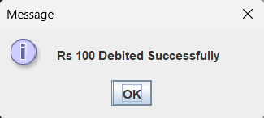
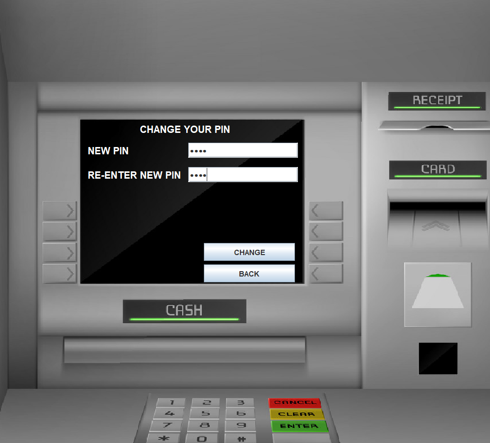

# 🏦 Bank Management System

## 📌 Description
This is a simple **Bank Management System** built using **Java** and **MySQL**. It allows users to:
- Create accounts
- Perform transactions (Deposit/Withdraw)
- Check account balance
- Manage customer records

## ⚡ Features
- Object-Oriented Java Implementation
- MySQL Database Integration
- User Authentication System

## 🔧 Prerequisites
- **Java (JDK 17 or above)**
- **MySQL installed and running**
- **MySQL Workbench (optional, for database management)**

## 🚀 Installation & Setup

1. **Clone the Repository**
   ```bash
   git clone https://github.com/Siddhaganesh/Bank-Management-System.git
   cd Bank-Management-System

   
## 📸 Screenshots  

### 🔐 Sign-In Page  
  

### 🆕 Sign-Up Process  
#### Step 1  
  

#### Step 2  
  

#### Step 3  
  

### ✅ Acknowledgement Page  
  

### 🏧 ATM Interface  
  

### 💰 Deposit Money  
  
  

### 📜 Transaction Page  
  

### 🔄 Withdraw Money  
  
  

### ⚡ Fast Cash Withdrawal  
  
  

### 📑 Mini Statement  
  

### 🔑 PIN Change  
  
  

### 💵 Balance Enquiry  
  
